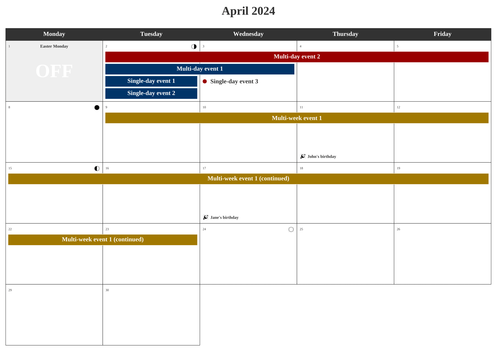
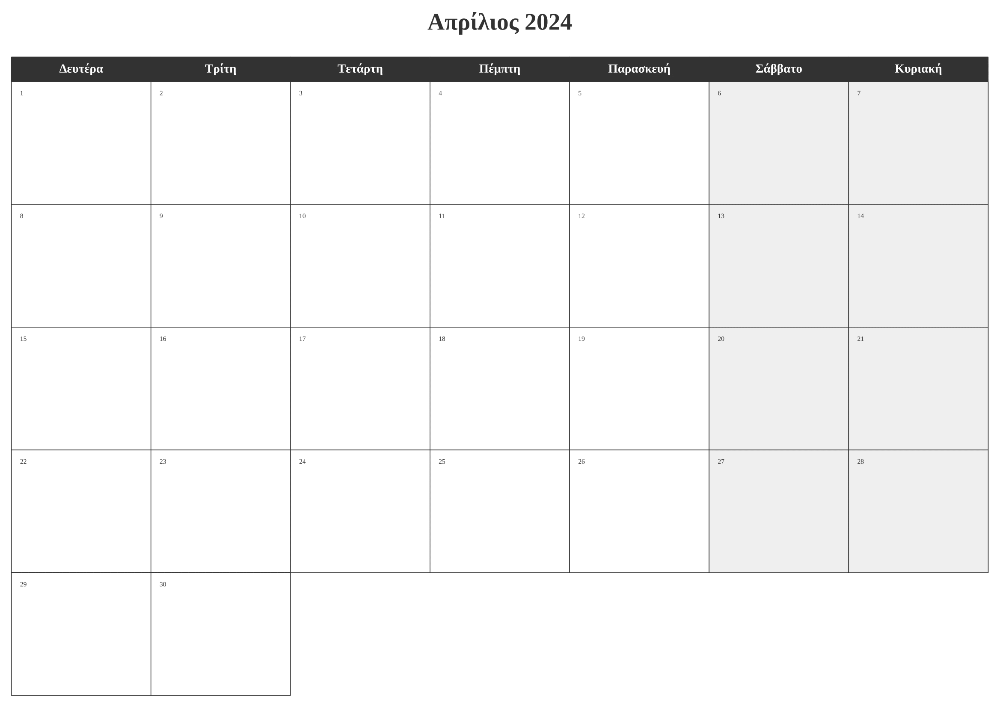

<!-- README.md is generated from README.Rmd. Please edit that file -->


```{r, include = FALSE}
knitr::opts_chunk$set(collapse  = TRUE,
                      comment   = "#>",
                      fig.path  = "man/figures/",
                      out.width = "100%")
```


planner 
=========================================================

<!-- badges: start -->
[](https://github.com/frbcesab/planner/actions/workflows/R-CMD-check.yaml)
[](https://github.com/frbcesab/planner/actions/workflows/pkgdown.yaml)
[](https://choosealicense.com/licenses/gpl-2.0/)
<!-- badges: end -->


<p align="left">
  • <a href="#overview">Overview</a><br>
  • <a href="#installation">Installation</a><br>
  • <a href="#get-started">Get started</a><br>
  • <a href="#citation">Citation</a><br>
  • <a href="#contributing">Contributing</a><br>
  • <a href="#acknowledgments">Acknowledgments</a>
</p>


## Overview


The R package `planner` is dedicated to create ready to print calendars. Calendars are saved as PDF files in the A4 paper format (297 x 210 mm). Users can choose between a monthly or annual calendar. Many features are available:

- choose between a full or working weeks calendar
- add holidays (available for 200+ countries)
- add special days (i.e. birthdays)
- add moon phases
- add single-day events
- add multi-day events
- add multi-week events
- add sub-calendars (event categories)
- change calendar language



<br/>



<br/>


## Installation

You can install the development version from [GitHub](https://github.com/) with:

```{r eval=FALSE}
## Install < remotes > package (if not already installed) ----
if (!requireNamespace("remotes", quietly = TRUE)) {
  install.packages("remotes")
}

## Install < planner > from GitHub ----
remotes::install_github("frbcesab/planner")
```

Then you can attach the package `planner`:

```{r eval=FALSE}
library("planner")
```


## Get started

For an overview of the main features of `planner`, please read the 
[Get started](https://frbcesab.github.io/planner/articles/planner.html)
vignette.


## Citation

Please cite `planner` as: 

> Casajus Nicolas (`r format(Sys.Date(), "%Y")`) planner: An R 
package to create a monthly calendar. R package version 0.0.0.9000. 
<https://github.com/frbcesab/planner/>


## Contributing

All types of contributions are encouraged and valued. For more information, 
check out our [Contributor Guidelines](https://github.com/frbcesab/planner/blob/main/CONTRIBUTING.md).

Please note that the `planner` project is released with a 
[Contributor Code of Conduct](https://contributor-covenant.org/version/2/1/CODE_OF_CONDUCT.html). 
By contributing to this project, you agree to abide by its terms.


## Acknowledgments

This package has been developed as part of a 
[FRB-CESAB](https://www.fondationbiodiversite.fr/en/about-the-foundation/le-cesab/) work.
