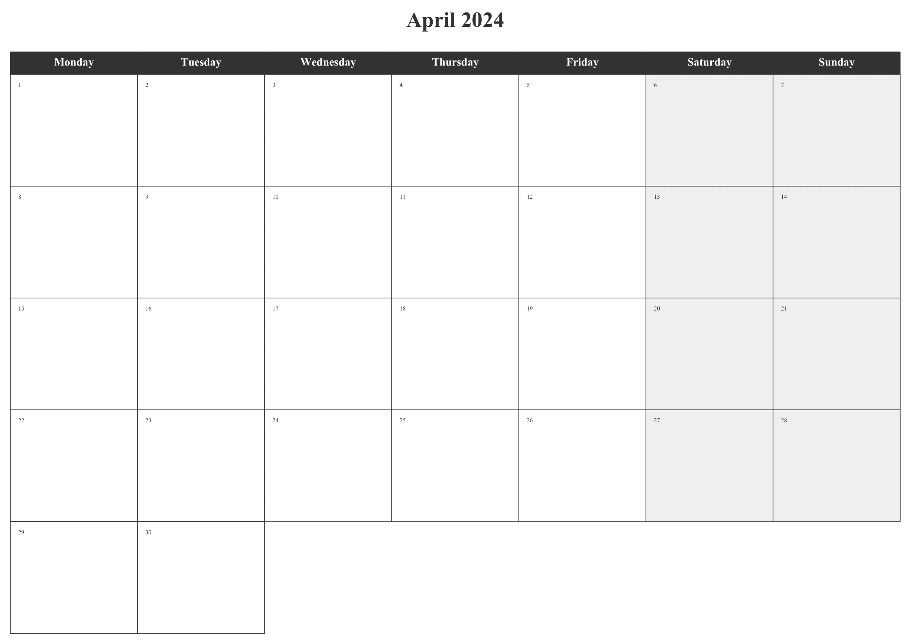
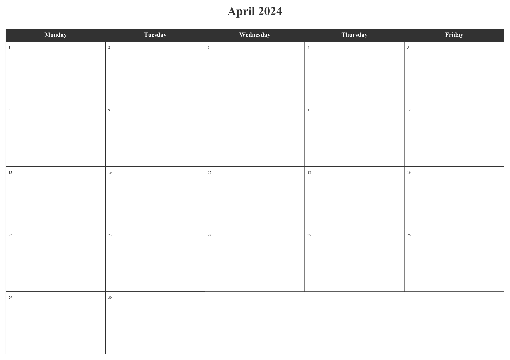
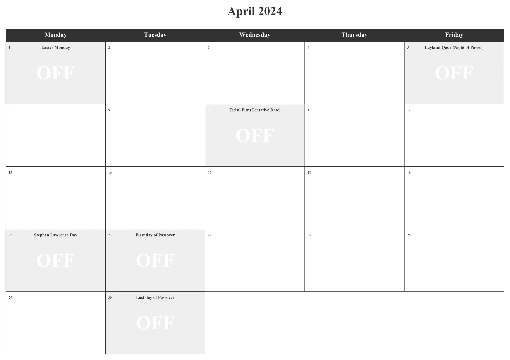
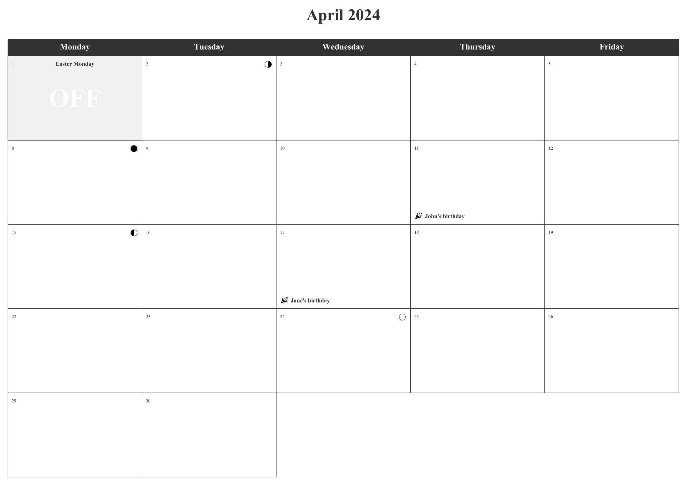
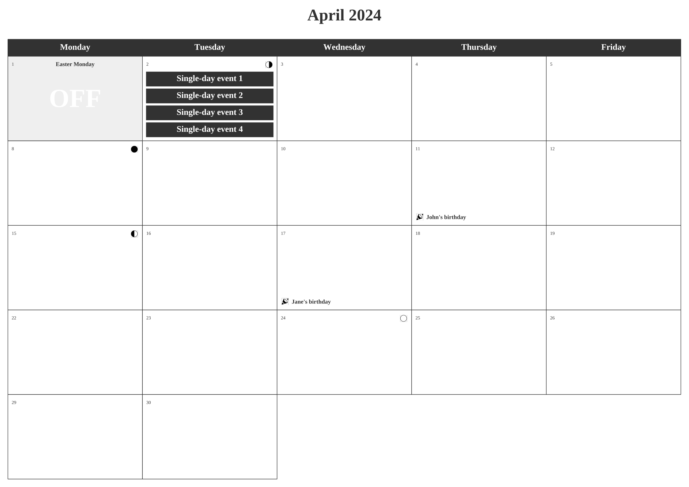
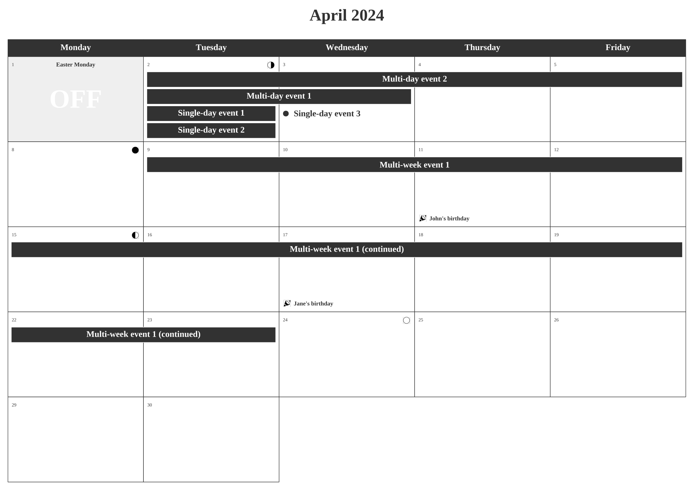
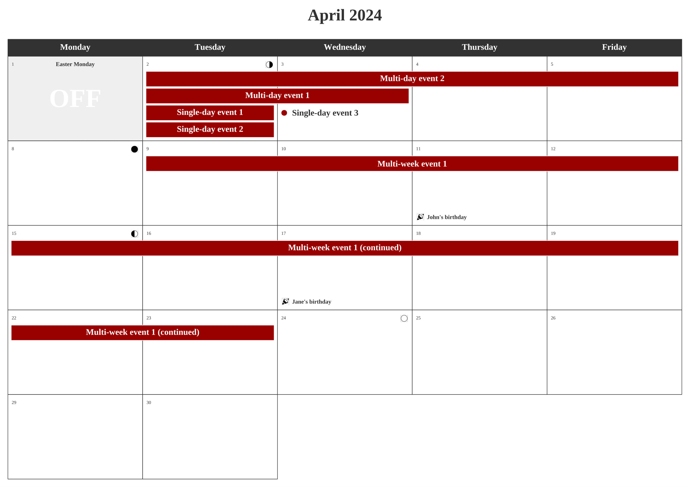

```{r include=FALSE}
knitr::opts_chunk$set(collapse  = TRUE,
                      echo      = TRUE,
                      eval      = FALSE,
                      comment   = "#>",
                      out.width = "100%",
                      dpi       = 96,
                      fig.align = "center")
```

The R package `planner` is dedicated to create ready to print calendars. Calendars are saved as `pdf` files in the A4 paper format. User can add various information: holidays (several countries available), moon phases, custom events (single-day, multi-day and multi-week events), and special days (like birthdays, etc.). 

This vignette shows how to customize calendars.

First, let's import the package.

```{r setup, eval=TRUE}
library("planner")
```

## Monthly calendar

```{r 'default-settings'}
monthly_calendar(year  = 2024, 
                 month = 4)
```

```{r echo=FALSE, eval=TRUE, out.width="100%", fig.cap = "Monthly calendar - Default settings", fig.align='center'}

```


### Working week

```{r 'working-week'}
monthly_calendar(year    = 2024, 
                 month   = 4, 
                 weekend = FALSE)
```

```{r echo=FALSE, eval=TRUE, out.width="100%", fig.cap = "Monthly calendar - Working weeks", fig.align='center'}

```


### Moon phases

```{r 'moon-phases'}
monthly_calendar(year    = 2024, 
                 month   = 4, 
                 weekend = FALSE, 
                 moon    = TRUE)
```

```{r echo=FALSE, eval=TRUE, out.width="100%", fig.cap = "Monthly calendar - Moon phases", fig.align='center'}
knitr::include_graphics("figures/calendar-demo-03.png")
```


### Holidays

```{r 'get-holidays'}
holidays <- get_holidays(year    = 2024, 
                         month   = 4, 
                         country = "UK")
holidays
#>         date                           name                 type
#> 1 2024-04-01                  Easter Monday Common Local Holiday
#> 2 2024-04-05 Laylatul Qadr (Night of Power)               Muslim
#> 3 2024-04-10   Eid ul Fitr (Tentative Date)               Muslim
#> 4 2024-04-22           Stephen Lawrence Day           Observance
#> 5 2024-04-23          First day of Passover       Jewish Holiday
#> 6 2024-04-30           Last day of Passover       Jewish Holiday
```

```{r 'holidays-1'}
monthly_calendar(year     = 2024, 
                 month    = 4, 
                 weekend  = FALSE, 
                 moon     = TRUE,
                 holidays = holidays)
```

```{r echo=FALSE, eval=TRUE, out.width="100%", fig.cap = "Monthly calendar - UK Holidays", fig.align='center'}

```


```{r 'filter-holidays'}
get_holiday_types(holidays)
#> [1] "Common Local Holiday" "Jewish Holiday"       "Muslim"              
#> [4] "Observance"

holidays <- filter_holidays(data  = holidays, 
                            types = "Common Local Holiday")
holidays
#>         date          name                 type
#> 1 2024-04-01 Easter Monday Common Local Holiday
```

```{r 'holidays-2'}
monthly_calendar(year     = 2024, 
                 month    = 4, 
                 weekend  = FALSE,
                 moon     = TRUE,
                 holidays = holidays)
```


```{r echo=FALSE, eval=TRUE, out.width="100%", fig.cap = "Monthly calendar - UK Holidays (filtered)", fig.align='center'}
knitr::include_graphics("figures/calendar-demo-05.png")
```

### Special events


```{r 'get-birthdays'}
birthdays <- data.frame("date" = c("2024-04-11", "2024-04-17"),
                        "name" = c("John's birthday", "Jane's birthday"))
birthdays
#>         date            name
#> 1 2024-04-11 John's birthday
#> 2 2024-04-17 Jane's birthday
```


```{r 'birthdays'}
monthly_calendar(year     = 2024, 
                 month    = 4, 
                 weekend  = FALSE,
                 moon     = TRUE,
                 holidays = holidays,
                 specials = birthdays)
```

```{r echo=FALSE, eval=TRUE, out.width="100%", fig.cap = "Monthly calendar - Special dates", fig.align='center'}

```


### Adding events

#### Single-day events

```{r 'get-single-day-events'}
events <- data.frame()

events <- rbind(events,
                data.frame("name" = "Single-day event 1",
                           "from" = "2024-04-02",
                           "to"   = "2024-04-02"))
events <- rbind(events,
                data.frame("name" = "Single-day event 2",
                           "from" = "2024-04-02",
                           "to"   = "2024-04-02"))
events <- rbind(events,
                data.frame("name" = "Single-day event 3",
                           "from" = "2024-04-02",
                           "to"   = "2024-04-02"))
events <- rbind(events,
                data.frame("name" = "Single-day event 4",
                           "from" = "2024-04-02",
                           "to"   = "2024-04-02"))
events
#>                 name       from         to
#> 1 Single-day event 1 2024-04-02 2024-04-02
#> 2 Single-day event 2 2024-04-02 2024-04-02
#> 3 Single-day event 3 2024-04-02 2024-04-02
#> 4 Single-day event 4 2024-04-02 2024-04-02
```


```{r 'single-day-events'}
monthly_calendar(year     = 2024, 
                 month    = 4, 
                 weekend  = FALSE,
                 moon     = TRUE,
                 holidays = holidays,
                 specials = birthdays,
                 events   = events)
```

```{r echo=FALSE, eval=TRUE, out.width="100%", fig.cap = "Monthly calendar - Single-day events", fig.align='center'}

```

...


```{r 'get-single-day-events-2'}
events <- rbind(events,
                data.frame("name" = "Single-day event 5",
                           "from" = "2024-04-03",
                           "to"   = NA))
events
#>                 name       from         to
#> 1 Single-day event 1 2024-04-02 2024-04-02
#> 2 Single-day event 2 2024-04-02 2024-04-02
#> 3 Single-day event 3 2024-04-02 2024-04-02
#> 4 Single-day event 4 2024-04-02 2024-04-02
#> 5 Single-day event 5 2024-04-03       <NA>
```

```{r 'single-day-event-2'}
monthly_calendar(year     = 2024, 
                 month    = 4, 
                 weekend  = FALSE,
                 moon     = TRUE,
                 holidays = holidays,
                 specials = birthdays,
                 events   = events)
```

```{r echo=FALSE, eval=TRUE, out.width="100%", fig.cap = "Monthly calendar - Single-day events (bis)", fig.align='center'}

```


#### Multi-day events

```{r 'get-multi-day-events'}
events <- data.frame()

events <- rbind(events,
                data.frame("name" = "Multi-day event 1",
                           "from" = "2024-04-02",
                           "to"   = "2024-04-03"))
events <- rbind(events,
                data.frame("name" = "Multi-day event 2",
                           "from" = "2024-04-02",
                           "to"   = "2024-04-05"))
events <- rbind(events,
                data.frame("name" = "Single-day event 1",
                           "from" = "2024-04-02",
                           "to"   = "2024-04-02"))
events <- rbind(events,
                data.frame("name" = "Single-day event 2",
                           "from" = "2024-04-02",
                           "to"   = "2024-04-02"))
events <- rbind(events,
                data.frame("name" = "Single-day event 3",
                           "from" = "2024-04-03",
                           "to"   = NA))
events
#>                 name       from         to
#> 1  Multi-day event 1 2024-04-02 2024-04-03
#> 2  Multi-day event 2 2024-04-02 2024-04-05
#> 3 Single-day event 1 2024-04-02 2024-04-02
#> 4 Single-day event 2 2024-04-02 2024-04-02
#> 5 Single-day event 3 2024-04-03       <NA>
```


```{r 'multi-day-event'}
monthly_calendar(year     = 2024, 
                 month    = 4, 
                 weekend  = FALSE,
                 moon     = TRUE,
                 holidays = holidays,
                 specials = birthdays,
                 events   = events)
```

```{r echo=FALSE, eval=TRUE, out.width="100%", fig.cap = "Monthly calendar - Multi-day events", fig.align='center'}
knitr::include_graphics("figures/calendar-demo-09.png")
```


#### Multi-week events


```{r 'get-multi-week-events'}
events <- data.frame()

events <- rbind(events,
                data.frame("name" = "Multi-day event 1",
                           "from" = "2024-04-02",
                           "to"   = "2024-04-03"))
events <- rbind(events,
                data.frame("name" = "Multi-day event 2",
                           "from" = "2024-04-02",
                           "to"   = "2024-04-05"))
events <- rbind(events,
                data.frame("name" = "Single-day event 1",
                           "from" = "2024-04-02",
                           "to"   = "2024-04-02"))
events <- rbind(events,
                data.frame("name" = "Single-day event 2",
                           "from" = "2024-04-02",
                           "to"   = "2024-04-02"))
events <- rbind(events,
                data.frame("name" = "Single-day event 3",
                           "from" = "2024-04-03",
                           "to"   = NA))
events <- rbind(events,
                data.frame("name" = "Multi-week event 1",
                           "from" = "2024-04-09",
                           "to"   = "2024-04-23"))
events
#>                 name       from         to
#> 1  Multi-day event 1 2024-04-02 2024-04-03
#> 2  Multi-day event 2 2024-04-02 2024-04-05
#> 3 Single-day event 1 2024-04-02 2024-04-02
#> 4 Single-day event 2 2024-04-02 2024-04-02
#> 5 Single-day event 3 2024-04-03       <NA>
#> 6 Multi-week event 1 2024-04-09 2024-04-23
```


```{r 'multi-week-event'}
monthly_calendar(year     = 2024, 
                 month    = 4, 
                 weekend  = FALSE,
                 moon     = TRUE,
                 holidays = holidays,
                 specials = birthdays,
                 events   = events)
```

```{r echo=FALSE, eval=TRUE, out.width="100%", fig.cap = "Monthly calendar - Multi-week events", fig.align='center'}

```


### Colors


```{r 'change-color'}
monthly_calendar(year     = 2024, 
                 month    = 4, 
                 weekend  = FALSE,
                 moon     = TRUE,
                 holidays = holidays,
                 specials = birthdays,
                 events   = events,
                 palette  = "#990000")
```

```{r echo=FALSE, eval=TRUE, out.width="100%", fig.cap = "Monthly calendar - Customize colors", fig.align='center'}

```


```{r 'category-argument'}
events <- data.frame()

events <- rbind(events,
                data.frame("name"     = "Multi-day event 1",
                           "from"     = "2024-04-02",
                           "to"       = "2024-04-03",
                           "category" = "A"))
events <- rbind(events,
                data.frame("name"     = "Multi-day event 2",
                           "from"     = "2024-04-02",
                           "to"       = "2024-04-05",
                           "category" = "B"))
events <- rbind(events,
                data.frame("name"     = "Single-day event 1",
                           "from"     = "2024-04-02",
                           "to"       = "2024-04-02",
                           "category" = "A"))
events <- rbind(events,
                data.frame("name"     = "Single-day event 2",
                           "from"     = "2024-04-02",
                           "to"       = "2024-04-02",
                           "category" = "A"))
events <- rbind(events,
                data.frame("name"     = "Single-day event 3",
                           "from"     = "2024-04-03",
                           "to"       = NA,
                           "category" = "B"))
events <- rbind(events,
                data.frame("name"     = "Multi-week event 1",
                           "from"     = "2024-04-09",
                           "to"       = "2024-04-23",
                           "category" = "C"))
events
#>                 name       from         to category
#> 1  Multi-day event 1 2024-04-02 2024-04-03        A
#> 2  Multi-day event 2 2024-04-02 2024-04-05        B
#> 3 Single-day event 1 2024-04-02 2024-04-02        A
#> 4 Single-day event 2 2024-04-02 2024-04-02        A
#> 5 Single-day event 3 2024-04-03       <NA>        B
#> 6 Multi-week event 1 2024-04-09 2024-04-23        C
```

```{r 'change-color-2'}
monthly_calendar(year     = 2024, 
                 month    = 4, 
                 weekend  = FALSE,
                 moon     = TRUE,
                 holidays = holidays,
                 specials = birthdays,
                 events   = events,
                 palette  = c("A" = "#00356a",
                              "B" = "#990000",
                              "C" = "#a17900"))
```

```{r echo=FALSE, eval=TRUE, out.width="100%", fig.cap = "Monthly calendar - Customize colors (bis)", fig.align='center'}
knitr::include_graphics("figures/calendar-demo-12.png")
```


### Calendar language


## Annual calendar

Not implemented yet...
